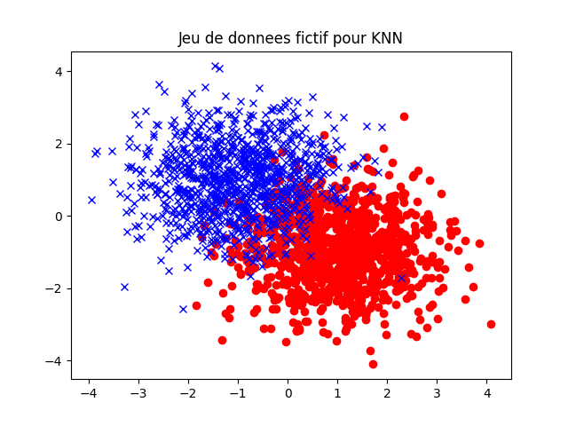
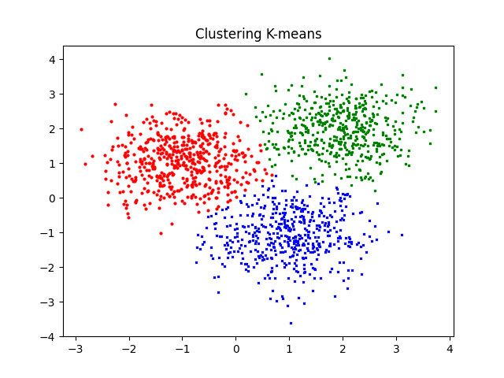

# Objectives

Personal experiments around basic ML.

## Projects

- Supervised learning :  KNN
- Unsupervised learning : clustering K-means

## Setup

```bash
python -m venv .venv
source .venv/bin/activate
pip install -r requirements.txt
```

## Results




